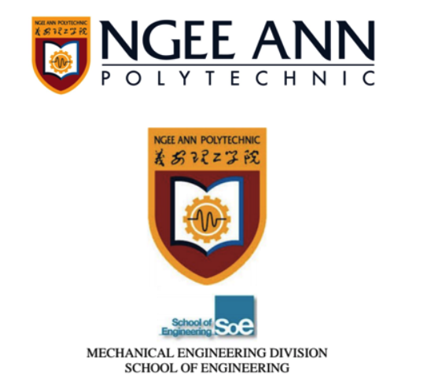
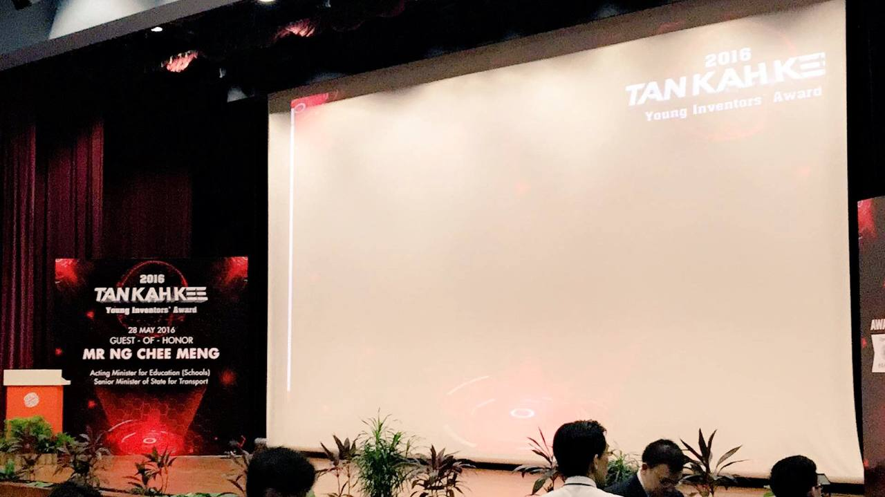

[![LinkedIn][linkedin-shield]][linkedin-url]
[![MIT License][license-shield]][license-url]

<!-- PROJECT LOGO -->
 

    
  </a>
  <h3 align="center">Innovative Foot Stabiliser Device</h3>
  

   A Mechanical Engineering Final Year Project  
  (Specialised in Biomedical Applications)
     
   
  

<!-- TABLE OF CONTENTS -->

  
Table of Contents

  <ol>
   <li>
      <a href="#about-the-project">About The Project</a>
    </li>
      <li>
      <a href="#Tan-Kah-Kee-Award">Tan Kah Kee Award Recipients</a>
     </li>
     <li>
      <a href="#ME-Innovation-Week">Presentation on ME Innovation Week</a>
    </li>
    <li><a href="#usage">Usage</a></li>
    <li><a href="#license">License</a></li>
    <li><a href="#contact">Contact</a></li>
  </ol>

### School /Organisation
A Collaborative work with Ngee Ann Polytechnic and the National University Hospital Singapore (NUH).

# About The Project
## Innovative Foot Stabiliser Device

This project involves the design and development of a device that helps aid nurses or doctors to be able to create a strain free environment while carrying out the Podiatry Treatment and also creating solutions for the patients accurately; preventing and possibly making minimal human error.

## Why the need for such an invention? 	

Existing items on the market fail to offer adequate dorsiflexion to the foot as a machine. Doctors or podiatrists must supply dorsiflexion to the feet in order to do the therapy with ease and with the least amount of human error. As a result, overuse problems such as strain, wrist discomfort, arm ache, and wrist strains are generated when the feet are held in position for an extended period of time. Finally, injuries or strains on the hands are possible since doctors will have to apply pressure to the area where the surgery is required, and most patients move around when they are in pain.

# Tan Kah Kee Award

 

# Ngee Ann Mechanical Engineering Innovation Week
Presenting to a Podiatry Doctor from NUH

<!-- CONTACT -->
## Contact
Lets Connect - [@Sashitharan](https://www.linkedin.com/in/sashitharan/) - sarsheyy@gmail.com

<!-- MARKDOWN LINKS & IMAGES -->
<!-- https://www.markdownguide.org/basic-syntax/#reference-style-links -->
[license-shield]: https://img.shields.io/github/license/othneildrew/Best-README-Template.svg?style=for-the-badge
[license-url]: https://github.com/othneildrew/Best-README-Template/blob/master/LICENSE.txt
[linkedin-shield]: https://img.shields.io/badge/-LinkedIn-black.svg?style=for-the-badge&logo=linkedin&colorB=555
[linkedin-url]: https://www.linkedin.com/in/sashitharan/
[product-screenshot]: images/screenshot.png
